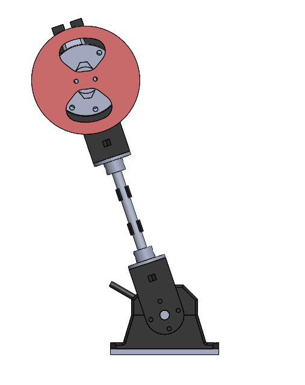
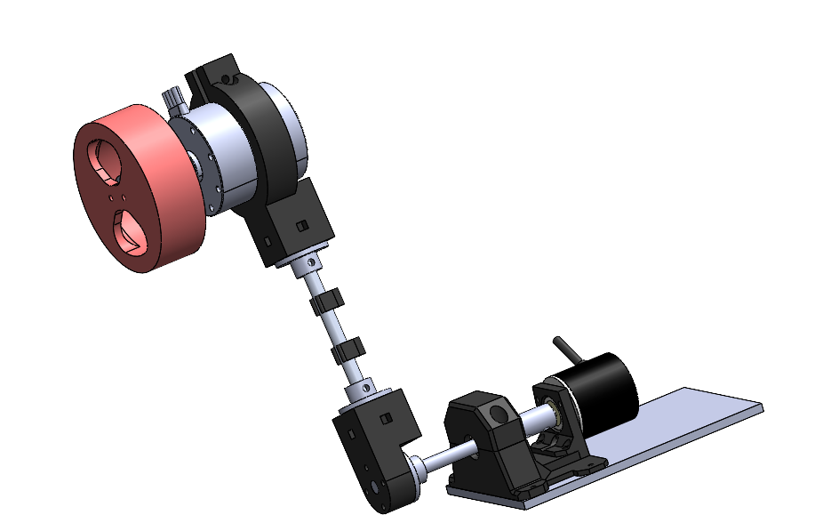

# Inertial Wheel Inverted Pendulum

A 3D-modeled and 3D-printed inertia wheel inverted pendulum (reaction wheel pendulum) — a classic underactuated mechanical system used to study balance control, where a spinning flywheel driven by a motor generates the reaction torque needed to stabilize the pendulum arm in the upright (inverted) position.

## Overview

This project is a mechanical and electromechanical build of an inertia wheel pendulum, designed and modeled in CAD before being 3D printed and assembled. The system consists of a pendulum arm free to rotate about a base pivot, topped with a reaction wheel that is directly driven by a brushless motor. By controlling the acceleration/deceleration of the wheel, a reaction torque is applied to the pendulum arm, which can be used to swing it up and balance it at the unstable equilibrium point.

## Photos

## Hardware

- **Motor:** REV Robotics NEO brushless motor — drives the reaction/inertia wheel
- **Sensor:** Incremental rotary encoder — measures pendulum arm angle/wheel position for feedback control
- **Encoder (embedded in motor):** Encoder built into the NEO motor — measures the reaction wheel's speed and position
- **Couplings:** Multiple 3D-printed shaft couplings connecting the motor, wheel, and pivot assemblies
- **Structural parts:** Majority of mechanical parts 3D printed, with two parts printed in PLA

## Repository Contents

- CAD files for the full assembly (arm, base, wheel, motor mount, coupling parts)
- 3D-printable part files for the printed components

## Author

Ahmed Amine Sebti
